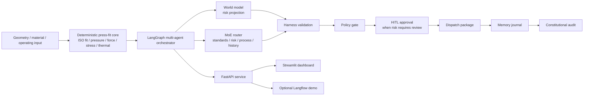

# Assembly Process Parameter Optimizer


[](LICENSE)


[中文说明](README.zh-CN.md)

Assembly Process Parameter Optimizer is a production-oriented backend for interference-fit assembly decisions. It combines deterministic press-fit physics, industrial multi-agent orchestration, Harness validation, HITL approval, and optional LLM specialist reasoning into one auditable workflow.

The core design choice is simple: physics and release gates live in code; agents enrich judgment, organize specialist reasoning, and prepare decision packages. No LLM is allowed to overwrite the deterministic facts.

## Architecture Overview



## Why You Might Care

Interference-fit assembly is exactly the kind of industrial problem where a loose AI answer is not enough. The system needs to calculate contact pressure, press force, safety factor, thermal route, and service margin in a repeatable way, then explain what action is allowed.

This repository is built around that boundary. It can run completely offline with deterministic rules, and it can optionally call OpenAI-compatible LLMs for specialist reasoning. Harness checks and policy gates remain in charge either way.

## Technical Strengths

| Area | What is implemented | Why it matters |
|---|---|---|
| Deterministic physics | ISO 286 fit lookup, effective interference, contact pressure, press force, holding torque, hub stress, thermal assembly temperature | Engineering facts stay stable and reviewable |
| Industrial multi-agent graph | LangGraph world model, MoE-style routing, standards/risk/process/history specialists, memory journal, constitutional audit | Agents have roles and guardrails instead of becoming one free-form chatbot |
| Harness validation | Machine checks verify physical reasonableness, recommendation consistency, and field completeness | Recommendations are checked before they are trusted |
| HITL and policy gate | Low-risk cold press can auto-dispatch; higher-risk routes pause for approval | The system respects industrial responsibility boundaries |
| Optional LLM specialists | OpenAI-compatible live calls or local mock provider | Demo without keys, enrich reasoning when keys are available |
| Multi-surface delivery | FastAPI, Streamlit dashboard, Langflow gateway, JSON/HTML reports, dispatch artifacts | Same backend serves engineering use, demos, and review workflows |

## Quick Start

### Environment

- Python `3.11+`
- Windows PowerShell for the bundled scripts
- Optional: an OpenAI-compatible API key if you want live LLM specialists

### Local Startup

```powershell
git clone https://github.com/alexhuang-dev/assembly-optimizer-system.git
cd assembly-optimizer-system
python -m venv .venv
.\.venv\Scripts\python -m pip install -r requirements.txt
.\.venv\Scripts\python -m pytest tests -q
powershell -ExecutionPolicy Bypass -File .\start_stack.ps1
```

After startup:

- API docs: [http://127.0.0.1:8010/docs](http://127.0.0.1:8010/docs)
- Health check: [http://127.0.0.1:8010/health](http://127.0.0.1:8010/health)
- Dashboard: [http://127.0.0.1:8510](http://127.0.0.1:8510)

Stop services:

```powershell
powershell -ExecutionPolicy Bypass -File .\stop_stack.ps1
```

## How To Use It

### 1. Send One Scenario To The API

```powershell
$body = Get-Content .\demo_cases\01_baseline_normal_cold_press.json -Raw -Encoding UTF8

Invoke-RestMethod `
  -Method Post `
  -Uri http://127.0.0.1:8010/analyze `
  -ContentType "application/json" `
  -Body $body
```

Example response shape:

```json
{
  "run_id": "20260422093000_7ac14b31",
  "analysis_result": {
    "fit_code": "H7/p6",
    "overall_status": "normal"
  },
  "agent_recommendation": {
    "primary_method": "cold_press"
  },
  "risk_eval": {
    "level": "normal"
  },
  "harness_eval": {
    "passed": true,
    "score": 1.0
  }
}
```

### 2. Run The Multi-Agent Graph

```powershell
$body = Get-Content .\demo_cases\02_warning_thermal_route.json -Raw -Encoding UTF8

Invoke-RestMethod `
  -Method Post `
  -Uri http://127.0.0.1:8010/multiagent/runs `
  -ContentType "application/json" `
  -Body $body
```

If the result returns `status = waiting_for_approval`, resume it with:

```powershell
Invoke-RestMethod `
  -Method Post `
  -Uri "http://127.0.0.1:8010/multiagent/runs/<thread_id>/resume" `
  -ContentType "application/json" `
  -Body '{"decision":"approve","comment":"Reviewed for demo release"}'
```

### 3. Use The Langflow Demo

Supported Langflow entry:

```text
langflow_integration/assembly_optimizer_multiagent_import_ready_flow.json
```

The custom component is:

```text
langflow_integration/assembly_optimizer_component.py
```

Use Langflow for visual demo and operator-facing narration. Keep deterministic calculation, Harness, policy, and HITL decisions in the backend.

## Optional LLM Specialists

The system runs without external models by default. To enable live specialists, copy `.env.example` and fill only local environment values:

```powershell
Copy-Item .env.example .env
```

Key variables:

```text
ASSEMBLY_LLM_ENABLED=true
ASSEMBLY_LLM_PROVIDER=openai_compatible
ASSEMBLY_LLM_MODEL=<model-name>
ASSEMBLY_LLM_API_BASE_URL=https://api.openai.com/v1
ASSEMBLY_LLM_API_KEY=<provider-api-key>
```

For offline tests and demos, use:

```json
{
  "config": {
    "llm": {
      "enabled": true,
      "provider": "mock",
      "model": "industrial-mock"
    }
  }
}
```

## Project Structure

```text
api/                   FastAPI endpoints
agents/                deterministic risk and decision baselines
core/                  press-fit physics, ISO fits, history, reports
harness/               machine validation checks
multiagent/            LangGraph orchestration and specialist layer
dashboard/             Streamlit dashboard
langflow_integration/  Langflow gateway component and import-ready flow
demo_cases/            ready-made engineering scenarios
tests/                 pytest coverage and golden fixtures
data/                  local runtime data, ignored except .gitkeep
```

## Why It Is Designed This Way

- Deterministic code owns physical facts because press-fit numbers cannot drift with prompts.
- The graph separates specialist roles so risk, process, history, and audit can be tested independently.
- HITL exists because industrial execution authority should not be handed to an agent blindly.
- Langflow is treated as a presentation layer, not the source of truth.

## Known Limitations

- The ISO 286 fit library is intentionally curated for demo and early engineering use.
- The project does not connect directly to PLC, MES, ERP, SCADA, or machine controllers.
- Dispatch artifacts are JSON instruction packages, not real actuator commands.
- Live LLM specialists require a user-provided OpenAI-compatible endpoint and key.
- GitHub Actions is not enabled in this repository until the publishing token receives `workflow` scope.

## Testing

```powershell
.\.venv\Scripts\python -m pytest tests -q
```

Smoke tests after the API is running:

```powershell
powershell -ExecutionPolicy Bypass -File .\smoke_test.ps1
powershell -ExecutionPolicy Bypass -File .\smoke_test_multiagent.ps1
```

## Additional Docs

- [中文说明](README.zh-CN.md)
- [Demo cases](demo_cases/README.md)
- [Langflow setup](langflow_integration/SETUP.md)
- [Release notes](RELEASE_NOTES_v1.0.0.md)
- [Security notes](SECURITY.md)
