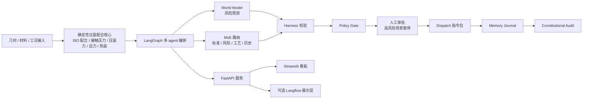

# 装配工艺参数优化系统


[](LICENSE)


[English](README.md)

装配工艺参数优化系统是一套面向过盈配合装配决策的工程后端。它把确定性物理计算、工业多 agent 编排、Harness 校验、人工审批和可选 LLM 专家推理放进同一条可审计流程里。

这个项目的核心判断是：**物理计算和放行规则必须留在代码里，agent 负责组织专家判断、解释风险和生成决策包。LLM 不能改写确定性的工程事实。**

## 架构概览



## 这个项目解决什么问题

过盈配合不是一个适合让大模型随口判断的场景。系统必须稳定计算接触压力、压装力、安全系数、热装温度和服役余量，然后再决定什么建议可以放行。

这套系统就是围绕这个边界设计的：没有模型也能离线跑完整流程；接入 OpenAI-compatible LLM 后，可以让风险、工艺、世界模型和审计节点变得更会解释，但 Harness 和 Policy Gate 仍然是最后的约束。

## 技术优势

| 方向 | 已实现能力 | 价值 |
|---|---|---|
| 确定性物理计算 | ISO 286 配合、有效过盈量、接触压力、压装力、保持扭矩、轮毂应力、热装温度 | 工程事实稳定、可复核 |
| 工业多 agent 图 | LangGraph world model、MoE 路由、标准/风险/工艺/历史专家、记忆日志、宪法式审计 | agent 有职责边界，不是聊天堆叠 |
| Harness 校验 | 物理合理性、推荐一致性、字段完整性检查 | 建议在被信任前先被机器校验 |
| HITL 与策略门 | 低风险冷压可自动生成指令包，高风险路线进入人工审批 | 符合工业执行权限边界 |
| 可选 LLM 专家 | 支持 OpenAI-compatible 接口和 mock provider | 无密钥也能演示，有密钥可增强推理 |
| 多展示入口 | FastAPI、Streamlit、Langflow、JSON/HTML 报告、Dispatch artifacts | 后端、演示和评审共用一套事实来源 |

## 快速启动

### 环境要求

- Python `3.11+`
- Windows PowerShell
- 可选：OpenAI-compatible API key，用于开启真实 LLM 专家

### 本地启动

```powershell
git clone https://github.com/alexhuang-dev/assembly-optimizer-system.git
cd assembly-optimizer-system
python -m venv .venv
.\.venv\Scripts\python -m pip install -r requirements.txt
.\.venv\Scripts\python -m pytest tests -q
powershell -ExecutionPolicy Bypass -File .\start_stack.ps1
```

启动后访问：

- API 文档：[http://127.0.0.1:8010/docs](http://127.0.0.1:8010/docs)
- 健康检查：[http://127.0.0.1:8010/health](http://127.0.0.1:8010/health)
- Dashboard：[http://127.0.0.1:8510](http://127.0.0.1:8510)

停止服务：

```powershell
powershell -ExecutionPolicy Bypass -File .\stop_stack.ps1
```

## 使用方式

### 1. 单次确定性分析

```powershell
$body = Get-Content .\demo_cases\01_baseline_normal_cold_press.json -Raw -Encoding UTF8

Invoke-RestMethod `
  -Method Post `
  -Uri http://127.0.0.1:8010/analyze `
  -ContentType "application/json" `
  -Body $body
```

### 2. 多 agent 编排

```powershell
$body = Get-Content .\demo_cases\02_warning_thermal_route.json -Raw -Encoding UTF8

Invoke-RestMethod `
  -Method Post `
  -Uri http://127.0.0.1:8010/multiagent/runs `
  -ContentType "application/json" `
  -Body $body
```

如果返回 `waiting_for_approval`，说明策略门要求人工审批。用返回的 `thread_id` 继续：

```powershell
Invoke-RestMethod `
  -Method Post `
  -Uri "http://127.0.0.1:8010/multiagent/runs/<thread_id>/resume" `
  -ContentType "application/json" `
  -Body '{"decision":"approve","comment":"Reviewed for demo release"}'
```

### 3. Langflow 展示

推荐导入：

```text
langflow_integration/assembly_optimizer_multiagent_import_ready_flow.json
```

自定义组件：

```text
langflow_integration/assembly_optimizer_component.py
```

Langflow 只作为展示层。计算、Harness、Policy Gate、HITL 都在后端。

## 可选 LLM 专家

默认不调用外部模型。需要真实 LLM 专家时，复制 `.env.example`：

```powershell
Copy-Item .env.example .env
```

常用变量：

```text
ASSEMBLY_LLM_ENABLED=true
ASSEMBLY_LLM_PROVIDER=openai_compatible
ASSEMBLY_LLM_MODEL=<model-name>
ASSEMBLY_LLM_API_BASE_URL=https://api.openai.com/v1
ASSEMBLY_LLM_API_KEY=<provider-api-key>
```

离线演示可以使用 mock provider：

```json
{
  "config": {
    "llm": {
      "enabled": true,
      "provider": "mock",
      "model": "industrial-mock"
    }
  }
}
```

## 项目结构

```text
api/                   FastAPI 接口
agents/                确定性风险和工艺建议基线
core/                  过盈配合物理计算、ISO 配合、历史、报告
harness/               机器校验
multiagent/            LangGraph 编排和专家层
dashboard/             Streamlit 看板
langflow_integration/  Langflow 网关组件和可导入流程
demo_cases/            演示工况
tests/                 pytest 测试和 golden fixtures
data/                  本地运行数据，除 .gitkeep 外不入库
```

## 已知限制

- ISO 286 配合库是精选子集，适合演示和早期工程验证。
- 当前不直接对接 PLC、MES、ERP、SCADA 或真实控制器。
- Dispatch 产物是 JSON 指令包，不是实际设备控制命令。
- 真实 LLM 专家需要用户自己提供 OpenAI-compatible endpoint 和 key。
- GitHub Actions 暂未启用，原因是当前发布 token 没有 `workflow` scope。

## 测试

```powershell
.\.venv\Scripts\python -m pytest tests -q
```

API 启动后可以跑 smoke test：

```powershell
powershell -ExecutionPolicy Bypass -File .\smoke_test.ps1
powershell -ExecutionPolicy Bypass -File .\smoke_test_multiagent.ps1
```

## 相关文档

- [Demo cases](demo_cases/README.md)
- [Langflow setup](langflow_integration/SETUP.md)
- [Release notes](RELEASE_NOTES_v1.0.0.md)
- [Security notes](SECURITY.md)
